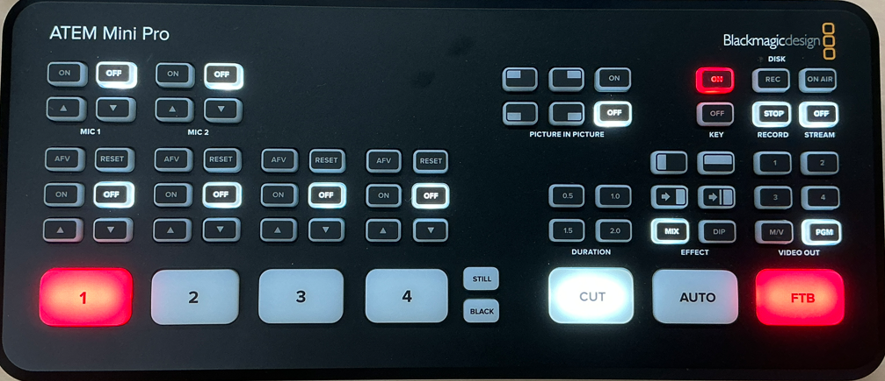

# ATEM Mini Pro 操作マニュアル

ATEM Mini Proは、遠隔授業で使用する映像を切り替えたり、クロマキー合成を行ったりするための機器です。

本マニュアルでは、現在の配信環境で授業を行うために必要な基本操作を説明します。

---

## ATEM Mini Proとは

複数の映像入力を切り替え、授業用の映像として出力するビデオスイッチャーです。

*ATEM Mini Pro本体。1〜4のボタンで入力映像を選択します。*

## 映像を切り替える

ATEM Mini Pro本体の「1・2・3・4」のボタンで、使用する映像を選択します。

現在の配信環境では、必要な番号のボタンを押すことで、ディスプレイに表示する映像を切り替えることができます。

## ATEM Software Control

ATEM Software Controlでは、ATEM Mini Proをパソコン上から操作できます。

### PROGRAMとPREVIEW

**PROGRAM** は、現在配信している映像です。  
**PREVIEW** は、次に切り替える映像をあらかじめ選択するために使用します。

### CUTとAUTO

**CUT** は、PROGRAMとPREVIEWの映像を瞬時に切り替えます。  
**AUTO** は、設定したトランジション効果を使って映像を切り替えます。

## クロマキー合成

クロマキー合成では、グリーンバックで撮影した教員映像から背景色を取り除き、教材などの背景映像と重ねて表示します。

### KEY1 ON AIR

クロマキー合成した教員映像の表示・非表示を切り替えます。

### BKGD / KEY1

次の切り替え操作で、背景映像（BKGD）とクロマキー映像（KEY1）のどちらを切り替えるか選択します。

### Tバー

KEY1を選択した状態でTバーを操作すると、背景映像を変えずに、教員映像だけを徐々に表示・非表示にできます。

## 配信前の確認

授業開始前に、HDMI入力、HDMI OUT、映像切り替え、クロマキー合成が正常に動作することを確認します。