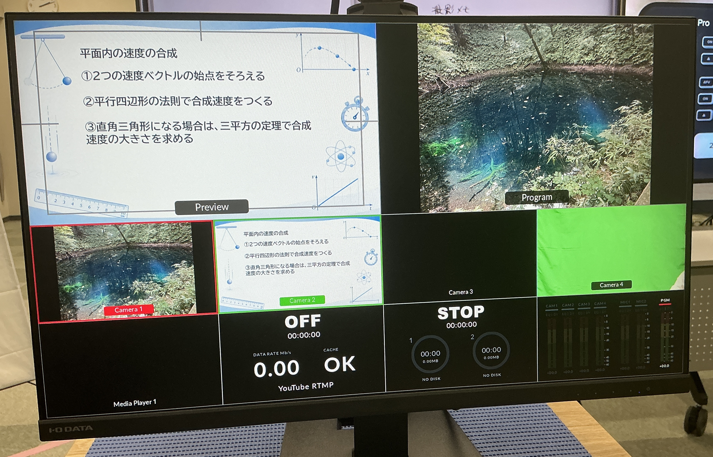
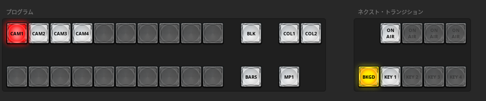
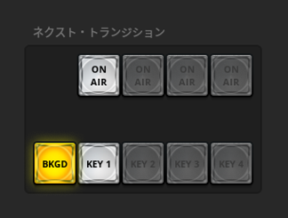

# はじめに

## ATEM Mini Proとは

ATEM Mini Proは、パソコンやカメラなどから入力された複数の映像を切り替えたり、合成したりして、配信する画面を作る機器です。

## 配信画面の基本的な見方

まずは、ATEM Software Controlの画面で、出力する映像と入力されている映像の関係を確認します。

| 表示 | 意味 |
| --- | --- |
| **PROGRAM（プログラム）** | 現在、実際に配信・出力している映像です。 |
| **PREVIEW（プレビュー）** | 次に配信する映像を、あらかじめ選択・確認するための画面です。 |
| **CAM1～CAM4** | ATEM Mini Proの1～4番の端子に入力されている、パソコンやカメラなどの映像です。 |

CAM1～CAM4から映像を選び、**PROGRAM**には配信中の映像、**PREVIEW**には次に配信したい映像を表示します。ここでは画面の役割だけを覚え、切り替え方法や各ボタンの操作は「ATEM本体操作」「ATEM Software Control」で確認してください。

## クロマキー合成

クロマキー合成では、グリーンバックで撮影した教員映像から背景色を取り除き、教材などの背景映像と重ねて表示します。

1. ATEM Software Controlを起動します。
2. 背景にしたい映像を選びます。（画像はCAM1が選択されています。）
3. **ON AIR**を押します。（スイッチが赤に光ります）

背景映像の前に教員映像が表示されます。もう一度**ON AIR**を押すと、教員映像が非表示になります。

### クロマキー合成の例

<figure class="chroma-key-example">
  
  <figcaption>グリーンバックの教員映像と、背景を除去して教材上に合成した映像の例</figcaption>
</figure>

### 教員映像を薄く表示する

1. Tバーが一番下にあることを確認します。

    

2. **KEY1**を選択します。（スイッチが黄色に光ります）

    

3. Tバーを上げて、教員映像の濃さを調整します。

板書や教材と教員映像が重なる場合に有効です。

<figure class="chroma-key-example">
  
  <figcaption>教材の文字や図を隠しにくくするため、教員映像を白抜き・半透明で表示した例</figcaption>
</figure>
