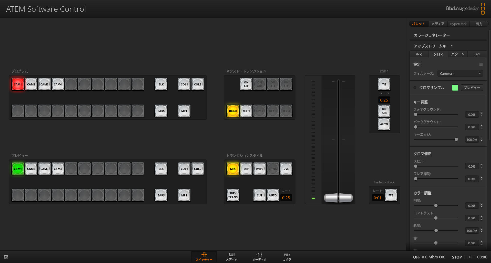

# ATEM Software Control

ATEM Software Controlは、ATEM Mini Proをパソコン上から操作するためのソフトウェアです。

*ATEM Software Control の全体画面*

## 出力する映像を切り替える

### プログラム／プレビュー

**プログラム**は、現在出力している映像です。

**プレビュー**は、次に切り替える映像をあらかじめ選択するために使用します。

### CUT / AUTO

Software Control画面上の**CUT**を選択すると、プログラムとプレビューの映像が瞬時に切り替わります。

**AUTO**を選択すると、設定されているトランジション効果を使って映像が切り替わります。

## 次の切り替え対象を選ぶ

**NEXT TRANSITION**では、次の切り替え操作の対象を選択します。

次の切り替え操作で、背景映像（**BKGD**）とクロマキー映像（**KEY1**）のどちらを切り替えるか選択します。

## 簡単クロマキー合成

クロマキー合成では、グリーンバックで撮影した教員映像から背景色を取り除き、教材などの背景映像と重ねて表示します。

1. ATEM Software Controlを起動します。
2. 背景にしたい映像を選びます。
3. **KEY1 ON AIR**を押します。

背景映像の前に教員映像が表示されます。もう一度**KEY1 ON AIR**を押すと、教員映像が非表示になります。

### 教員映像を薄く表示する

1. Tバーが一番下にあることを確認します。
2. **KEY1**を選択します。
3. Tバーを上げて、教員映像の濃さを調整します。

板書や教材と教員映像が重なる場合に有効です。

### クロマキーを調整する

クロマキーの設定は、ATEM Software Control上でキーの種類や抜き取る背景色などを調整します。調整後は、合成結果を確認してから授業で使用します。
