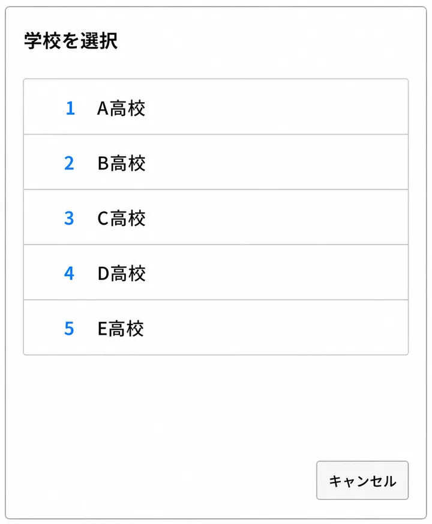

# 1　ログイン・学校の選択

授業準備を始める前に、MetaMoJi ClassRoomへログインし、**これから授業を行う学校を選択します。**

!!! warning "学校の選択に注意"
    複数の学校を担当している場合は、**選択する学校によって、表示されるクラスや授業ノートの配布先が変わります。**

---

## 1-1　MetaMoJi ClassRoomにログインする

[MetaMoJi ClassRoom 3 ログイン画面を開く](https://classroom.metamoji.com/cr/){ .md-button .md-button--primary target="_blank" }

MetaMoJi ClassRoomを起動し、配布された**ログイン用QRコード**を使用してログインします。

### QRコードでログインする【推奨】

1. MetaMoJi ClassRoomを起動します。
2. **［QRコードでログイン］**を選択します。
3. 配布されたログイン用QRコードをカメラにかざします。

!!! note "QRコードが使用できない場合"
    団体ID・ユーザーID・パスワードを入力してログインします。

---

## 1-2　授業を行う学校を選択する

ログイン後、**これから授業を行う学校を選択します。**

複数の学校を担当している教員は、授業ごとに使用する学校が異なります。

### 学校を選択する

1. 学校を選択する画面を開きます。
2. これから授業を行う学校を選択します。

### 学校を切り替えると変わるもの

学校を切り替えると、その学校に対応したクラスボックスや配布先が表示されます。

一方、**マイボックスは学校を切り替えても共通して使用します。**

| 項目 | 学校を切り替えたとき |
|---|---|
| マイボックス | 共通して使用する |
| クラスボックス | 選択した学校に応じて変わる |
| 授業ノートの配布先 | 選択した学校に応じて変わる |
