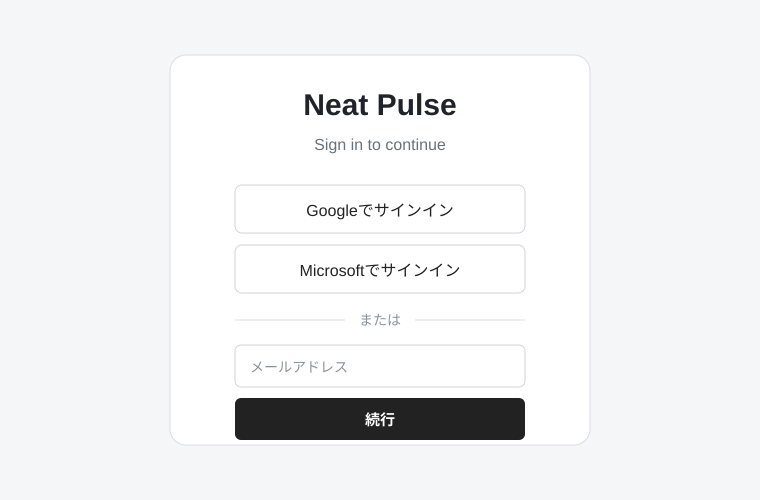
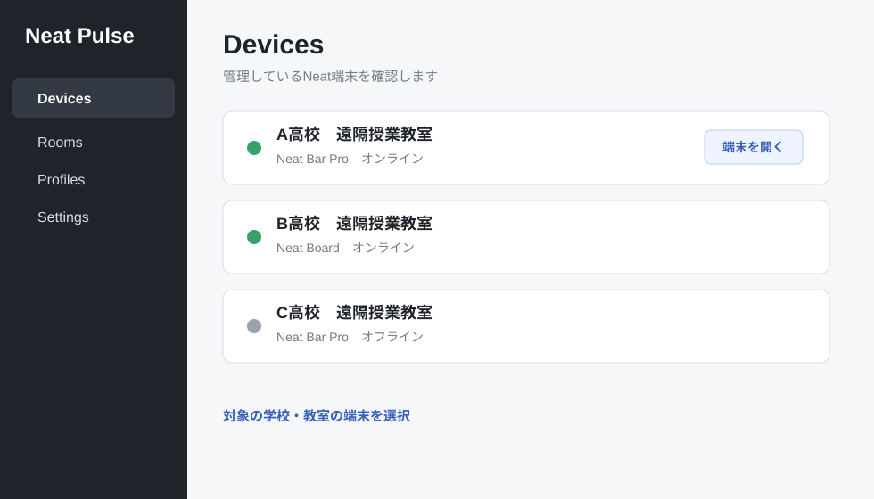
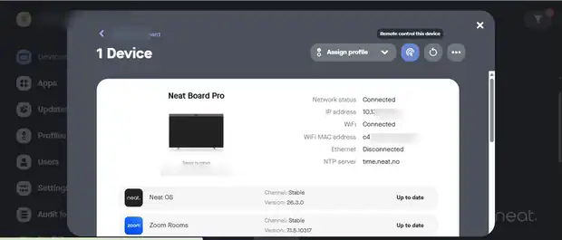

# Neat Pulse

Neat Pulseは、離れた場所にあるNeat端末の状態を確認し、必要に応じて遠隔操作するために使用します。

本マニュアルでは、遠隔授業で必要な操作に絞って説明します。

[Neat Pulseを開く](https://pulse.neat.no/){ .md-button .md-button--primary target="_blank" }

---

## 1　Neat Pulseにログインする

WebブラウザでNeat Pulseを開き、ログインします。

ログインには、**Googleアカウント、Microsoftアカウント、またはメールアドレスとパスワード**を使用できます。

<small>画面例（公開用に作成）</small>

---

## 2　端末の状態を確認する

ログインすると、管理しているNeat端末を確認できる **［Devices］** 画面が表示されます。

1. **［Devices］** を開きます。
2. 確認したい学校・教室の端末を探します。
3. 対象端末の状態を確認します。

<small>画面例（公開用に作成）</small>

| 状態 | 対応の目安 |
|---|---|
| **オンライン** | Neat Pulseから端末を確認・遠隔操作します。 |
| **オフライン** | 受信校側で電源やネットワーク接続を確認します。 |

!!! tip "遠隔操作する前に"
    対象端末が **オンライン** になっていることを確認します。

---

## 3　遠隔操作する

対象端末がオンラインの場合は、Neat Pulseから遠隔操作します。

1. **［Devices］** から対象端末を選択します。
2. 端末の画面で **［Remote control］** を選択します。
3. ブラウザに表示されたNeat端末の画面を操作します。
4. 操作が終わったら、Neat端末が通常の画面に戻っていることを確認して遠隔操作を終了します。

<small>画面例（公開用に作成）</small>

!!! warning "ミーティングを開始した場合は、退室してから遠隔操作を終了"
    遠隔操作中にZoom等のミーティングを開始した場合は、**必ずミーティングから退室した状態で遠隔操作を終了します。**

    ミーティングに参加したまま遠隔操作だけを終了すると、受信校側のNeat端末が**ミーティング画面のまま残る**ため、次に使用するときに支障が出ます。

!!! note "受信校側で確認が必要な場合"
    端末の設定によっては、遠隔操作を開始するときに **受信校側で許可操作が必要** になる場合があります。
