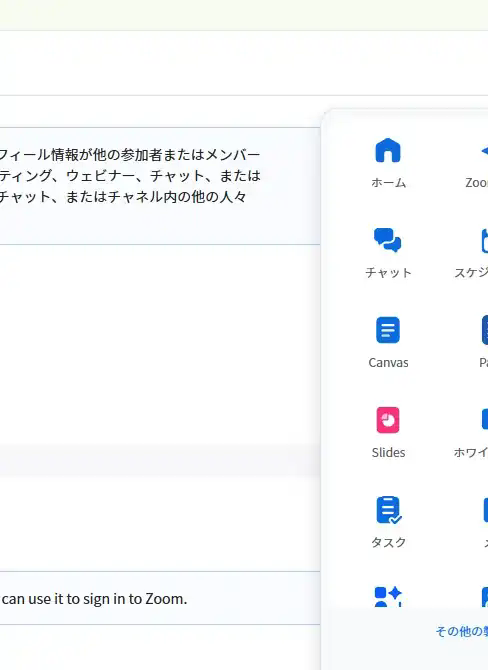
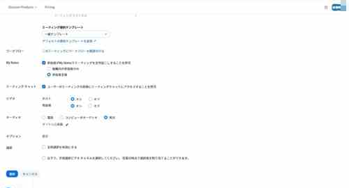
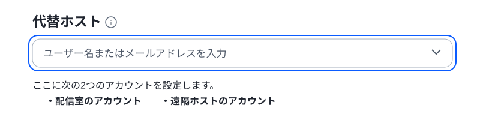
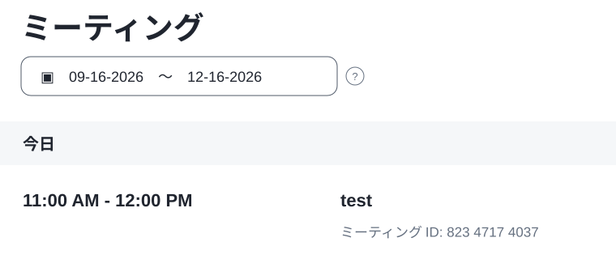

# ミーティングを作成する

遠隔授業で使用するZoomミーティングを、**新しいZoom Web画面**から作成します。

ミーティングの作成画面へは、次の2通りで移動できます。

- **方法1：9点メニュー → ミーティング → ミーティングをスケジュール**
- **方法2：9点メニュー → ホーム → スケジュール**

!!! tip "おすすめ"
    通常は、作成済みのミーティングも続けて確認できる**「方法1」**を使用すると分かりやすいです。

---

## 方法1　「ミーティング」から作成する

### 1　9点メニューから「ミーティング」を開く

Zoom Web画面の右上にある**9点メニュー**をクリックし、**「ミーティング」**を選択します。

### 2　「ミーティングをスケジュール」をクリックする

「ミーティング」画面が表示されたら、画面右上の**「ミーティングをスケジュール」**をクリックします。

---

## 方法2　「ホーム」から作成する

9点メニューから**「ホーム」**を開き、画面中央の**「スケジュール」**をクリックします。

!!! note
    方法1・方法2のどちらを使用しても、同じ**「ミーティングをスケジュールする」**画面が開きます。

---

## ミーティングの内容を設定する

### 3　基本情報を入力する

「ミーティングをスケジュールする」画面で、授業に必要な内容を入力します。

主に確認する項目は次のとおりです。

| 項目 | 設定内容 |
| --- | --- |
| トピック | 授業名など、内容が分かる名称を入力 |
| 開催日時 | 授業を実施する日時を設定 |
| 期間 | 授業時間に合わせて設定 |
| タイムゾーン | **(GMT+9:00) 大阪、札幌、東京** |
| ミーティングID | 基本は**「自動的に生成」**を使用 |

### 4　ビデオ・オーディオなどを確認する

画面を下へスクロールし、ビデオやオーディオなどの設定を確認します。

遠隔授業では、基本的に次の設定を確認します。

- **ビデオ：ホスト「オン」**
- **ビデオ：参加者「オン」**
- **オーディオ：「両方」**
- 必要に応じて、**「任意の時刻に参加することを参加者に許可する」**を設定
- 録画が必要な場合は、**「ミーティングを自動的にレコーディングする」**を設定

!!! note
    自動録画などの設定は、授業の運用方法に合わせて変更します。

### 5　必要に応じて「代替ホスト」を設定する

授業を担当するアカウントとは別のアカウントからホスト操作を行う場合は、**「代替ホスト」**を設定します。

入力欄をクリックし、使用するアカウントを選択して**「適用」**します。

### 6　「保存」をクリックする

設定が終わったら、画面下部の**「保存」**をクリックします。

保存したミーティングは、**「予定されているミーティング」**の一覧に表示されます。

---

## 作成後に確認すること

作成したミーティングについて、**授業日時・ミーティング名・ホスト設定**に間違いがないことを確認します。

受信校への参加案内や、Neat端末からの参加操作が必要な場合は、続けて各運用手順を確認します。
